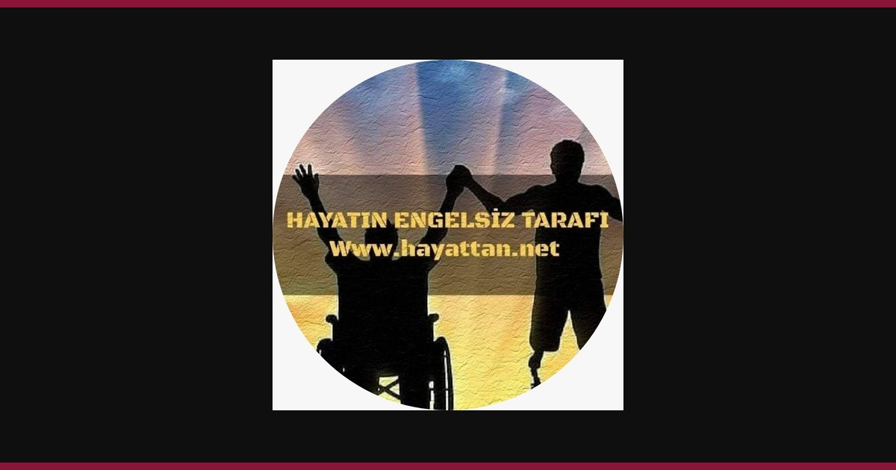
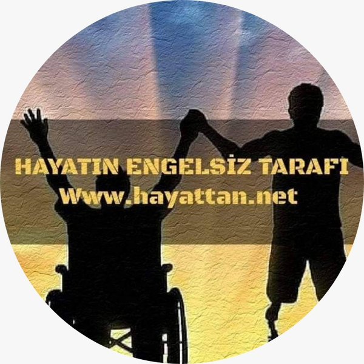

<div align="center">
  

  <h1>Hayattan.Net</h1>

  <p>
    <strong>Erişilebilir, hızlı ve güvenli bir dijital yayın platformu.</strong><br />
    Yazıları, yazarları, haberleri ve özgün görsel hikâyeleri modern bir içerik yönetim sistemiyle buluşturur.
  </p>

  <p>
    <a href="https://hayattan.net">Canlı Site</a>
    ·
    <a href="#yerel-geliştirme">Kurulum</a>
    ·
    <a href="#mimari">Mimari</a>
    ·
    <a href="#test-ve-kalite">Testler</a>
  </p>

  <p>
    
    
    
    
    
  </p>
</div>

---

## Proje hakkında

Hayattan.Net; içerik üretimi, yayın planlama, yazar yönetimi ve okur etkileşimini tek uygulamada yöneten kurumsal bir yayın platformudur. Next.js App Router mimarisi üzerine kuruludur ve hem herkese açık yayın deneyimini hem de yetkilendirilmiş yönetim panelini aynı kod tabanında sunar.

| Yayın deneyimi | Yönetim ve operasyon |
| --- | --- |
| Erişilebilir ve responsive arayüz | Rol tabanlı yönetim paneli |
| Yazı, yazar, kategori ve arşiv sayfaları | Yazı, haber, yazar ve kategori yönetimi |
| Arama, filtreleme ve öneri akışları | Taslak ve zamanlanmış yayın desteği |
| Favoriler, paylaşım ve okuma ölçümleri | Medya, reklam ve bülten yönetimi |
| SEO, Open Graph, sitemap ve RSS | Güvenlik kayıtları ve operasyonel metrikler |

## Öne çıkanlar

<table>
  <tr>
    <td width="46%">
      
    </td>
    <td width="54%" valign="top">
      <h3>Fotoğrafhane ve özgün içerik</h3>
      <p>Yazıların yanında fotoğraf odaklı içerikler, özel kategoriler ve editoryal seçkiler için ayrı yayın alanları bulunur.</p>
      <h3>Erişilebilirlik odaklı deneyim</h3>
      <p>Yazı boyutu, kontrast, hareket azaltma, klavye kullanımı ve ekran okuyucu uyumluluğu ürünün temel parçalarıdır.</p>
      <h3>Ölçülebilir yayıncılık</h3>
      <p>Okuma ilerlemesi, öneri etkileşimleri, paylaşım ve geri bildirim sinyalleri kişisel profil oluşturmadan takip edilir.</p>
    </td>
  </tr>
</table>

## Teknoloji altyapısı

| Katman | Teknoloji |
| --- | --- |
| Web uygulaması | Next.js 16 App Router, React 19, TypeScript |
| Stil ve arayüz | Tailwind CSS, Framer Motion, Tiptap |
| Veritabanı | PostgreSQL, Prisma ORM |
| Kimlik doğrulama | Auth.js / NextAuth v5 |
| Dosya depolama | Cloudflare R2, Vercel Blob, UploadThing |
| E-posta | Resend |
| Dağıtık rate limiting | Vercel KV / Upstash Redis |
| Test ve kalite | Playwright, ESLint, TypeScript |
| Dağıtım | Vercel |

## Mimari

Kod tabanı katmanlı ve feature-first olarak düzenlenmiştir:

```text
Tarayıcı
   │
   ▼
src/app                    Next.js rotaları ve API girişleri
   │
   ├──► src/frontend       Bileşenler, özellikler, layout ve UI
   │
   ├──► src/backend        İş kuralları, auth, veritabanı ve servisler
   │
   └──► src/shared         Ortak tipler ve saf yardımcılar
```

```text
src/
├── app/                          Yalnızca sayfa, layout ve API girişleri
├── backend/
│   ├── modules/
│   │   ├── advertising/         Reklam yönetimi ve metrikleri
│   │   ├── articles/            Yazı işlemleri ve içerik yardımcıları
│   │   ├── authors/             Yazar yönetimi
│   │   ├── categories/          Kategori ve ana sayfa seçimleri
│   │   ├── navigation/          Menü sorguları ve sıralama
│   │   ├── news/                Haber yönetimi
│   │   ├── pages/               Özel sayfalar
│   │   ├── search/              Arama filtreleri
│   │   └── settings/            Site içerik ayarları
│   ├── infrastructure/          Veritabanı, e-posta ve depolama
│   ├── security/                Rate limit, doğrulama ve sanitizasyon
│   └── config/                  Sunucu ortamı yapılandırması
├── frontend/
│   ├── features/                Makale, arama, reklam ve yazar özellikleri
│   ├── admin/                   Domain bazlı yönetim paneli özellikleri
│   ├── layout/                  Header, footer ve navigasyon
│   ├── providers/               React context sağlayıcıları
│   ├── ui/                      Ortak sunum bileşenleri
│   ├── hooks/                   İstemci hook'ları
│   └── styles/                  Paylaşılan stiller
└── shared/
    ├── advertising/
    ├── engagement/
    ├── media/
    └── types/
```

Katman sınırları ESLint kurallarıyla korunur. Backend, frontend veya rota katmanına ters bağımlılık kuramaz; `shared` yalnızca bağımsız ve iki tarafta kullanılabilen kod içerir. `app` katmanı Prisma altyapısını doğrudan içe aktaramaz ve veri erişimini backend repository/query girişleri üzerinden yapar.

## Yerel geliştirme

### Gereksinimler

- Node.js 20 veya üzeri
- npm
- PostgreSQL veritabanı

### Kurulum

```bash
git clone <repository-url>
cd hayattan-main
npm install
cp .env.example .env
npm run db:generate
npm run dev
```

Uygulama varsayılan olarak [http://localhost:3000](http://localhost:3000), yönetim paneli ise `/admin` adresinde çalışır.

## Ortam değişkenleri

Gerekli değerlerin açıklamalı listesi `.env.example` dosyasındadır. Temel production değişkenleri:

```env
DATABASE_URL=
DIRECT_DATABASE_URL=
AUTH_SECRET=
AUTH_URL=
NEXT_PUBLIC_SITE_URL=
```

E-posta, R2, Redis/KV ve analitik değişkenleri kullanılan özelliklere göre eklenebilir. Gerçek anahtarları hiçbir zaman repoya eklemeyin.

## Kullanılabilir komutlar

| Komut | Açıklama |
| --- | --- |
| `npm run dev` | Geliştirme sunucusunu başlatır |
| `npm run build` | Production derlemesi oluşturur |
| `npm run start` | Production sunucusunu çalıştırır |
| `npm run lint` | Kod ve katman kurallarını denetler |
| `npm run test:e2e` | Playwright uçtan uca testlerini çalıştırır |
| `npm run test:e2e:ui` | Playwright arayüzünü açar |
| `npm run db:generate` | Prisma Client üretir |
| `npm run db:migrate` | Yerel migration oluşturur ve uygular |
| `npm run db:studio` | Prisma Studio'yu açar |

## Test ve kalite

Projede üç doğrulama katmanı kullanılır:

```bash
npm run lint
npx tsc --noEmit
npm run test:e2e
```

Playwright senaryoları `tests/e2e/` altında tutulur. Testler; genel sayfaları, erişilebilirlik davranışlarını, yönetim girişini, aramayı ve okur etkileşim ölçümlerini kapsar.

## Güvenlik

- Kimlik bilgileri ve sunucu servisleri `server-only` sınırıyla korunur.
- Giriş ve hassas yazma işlemlerinde rate limiting uygulanır.
- Yönetim işlemleri rol ve oturum doğrulamasından geçer.
- Zengin metin içeriği izin listesiyle temizlenir.
- Parolalar güçlü parola politikası ve bcrypt ile korunur.
- Güvenlik olayları ayrı kayıt mekanizmasıyla izlenir.

## Dağıtım

Proje Vercel deployment yapısına hazırdır. Production öncesinde:

1. PostgreSQL bağlantılarını tanımlayın.
2. `AUTH_SECRET`, `AUTH_URL` ve site URL değerlerini ekleyin.
3. Kullanılan R2, Resend ve Redis/KV servislerini yapılandırın.
4. Prisma migration'larını production veritabanına uygulayın.
5. `npm run build` ile son doğrulamayı çalıştırın.

---

<div align="center">
  
  <p><strong>Hayattan.Net — Hayatın Engelsiz Tarafı</strong></p>
  <p><a href="https://hayattan.net">hayattan.net</a></p>
</div>
